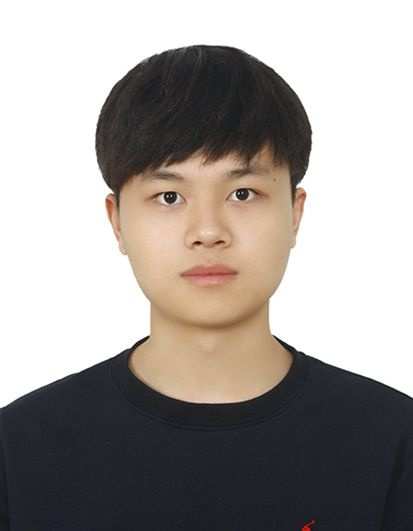

# Byeongin Jeun

## Introduction

Hello, My name is Byeongin Jeun.\
I am attending Sungkyunkwan University.  
I am a second year software major.\
I am interested in __AI__ technology.

## Skills
* __Language:__ C, C++, Java, Python  
* __Skills:__ Google analytics

## Education
* __Major:__ Sowftware in SKKU
  1. Open_Source Software Practice
  2. Problem Solving Techniques
  3. System Program
  4. JAVA Programming Lab
  5. System Program Practice

## Achievement
* TOEIC 950
* HSK
* AP Computer Science

## Contact
 >https://github.com/BottleIn \
 >byby123@g.skku.edu
